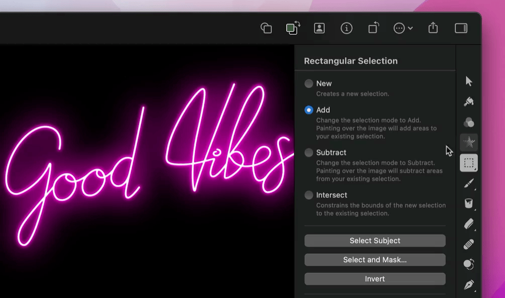

---
layout:
  title:
    visible: true
  description:
    visible: false
  tableOfContents:
    visible: true
  outline:
    visible: true
  pagination:
    visible: true
---

# Lighten a specific area of an image

The Lighten tool is used to lighten a specific area of an image. You could, for example, lighten a dark area of an otherwise well-exposed image to add extra emphasis to it.

***

## Lighten a specific area of an image

1. Do one of the following:
   * Choose the Lighten  tool in the Tools sidebar, or choose it from the [grouped tools](#user-content-fn-1)[^1].
   * Choose **Tools > Retouch > Lighten** from the Tools menu at the top of your screen.
2.  In the [Tool Options pane](https://www.pixelmator.com/support/guide/pixelmator-pro/#glossary), customize the Lighten tool.

    _Brush Size:_ Drag the Brush Size slider to adjust the size of the Lighten tool brush. Press and hold the Option ⌥ key to extend the range of the Brush Size slider beyond 100%. You can also manually enter a value from 0% to 200%.


    **Tip:** You can use the \[ and ] keys on your keyboard to change the size of the Lighten tool brush.

    _Softness:_ Drag the Softness slider to adjust the softness of the edges of the Lighten tool brush. With softer edges, the lightened areas will usually blend in better with the rest of the image.

    _Strength:_ Drag the Strength slider to adjust the intensity of the lightening effect.
3. Select a tonal range to lighten:

   * _All_: When you brush over an area to lighten it, the darkest, brightest, and midtone areas are lightened equally.

   * _Shadows_: When you brush over an area to lighten it, only the shadows are lightened.

   * _Midtones_: When you brush over an area to lighten it, only the midtones are lightened.
   * _Highlights_: When you brush over an area to lighten it, only the highlights are lightened.
4. Brush over the area of your image you’d like to lighten.



## Show before and after or reset effects

_Show Original:_ Click the Show Original button or press `Control ⌃` + `M` on your keyboard to see what the image looks like without any effects.

_Show Split Comparison:_ `Option ⌥` – click the Show Original button, press `Control ⌃` + `C` on your keyboard, or force-click the canvas.

To reset all effects, click Reset at the bottom of the Tool Options pane.

[^1]: Some of the tools in the Tools sidebar are grouped based on their function. To select a different tool from a group, double-click, force click, or Control-click any grouped tool in the Tools sidebar. See [Pixelmator Pro tools](../pixelmator-pro-basics/pixelmator-pro-tools.md) to learn more about the tool groups.\
    \
    
