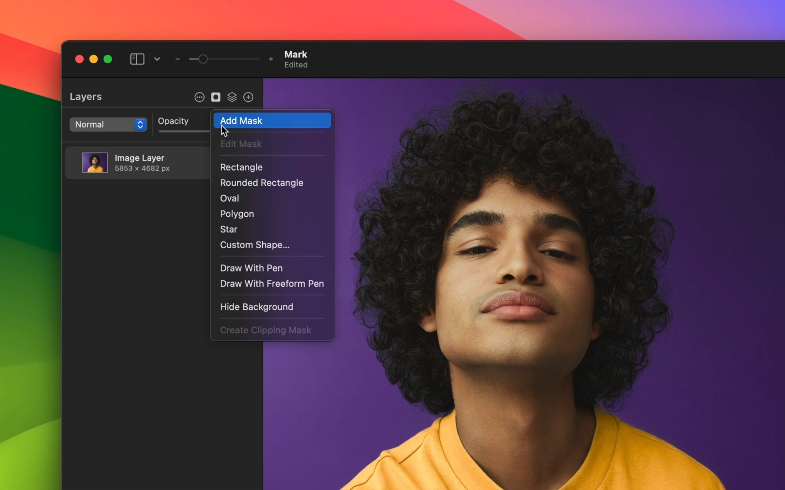

---
layout:
  title:
    visible: true
  description:
    visible: false
  tableOfContents:
    visible: true
  outline:
    visible: true
  pagination:
    visible: true
---

# Add masks

A layer mask is like an additional sheet you can place over a layer or layer group to hide parts of it. Layer masks are nondestructive because even though the parts they hide are no longer shown, the original layer is fully preserved, and if you turn off or remove the mask, the full layer will reappear. You can also go back to make adjustments to layer masks after adding them.

The quickest way to add a mask is by choosing an option from the special Mask  menu at the top of the layers sidebar. Here, you can choose one of the options:

* Create a simple [bitmap mask](working-with-bitmap-masks.md) that you can paint on with black or white to hide or reveal areas.
* Create a [vector mask](working-with-vector-masks.md), masking a layer into a specific shape.
* Draw a custom vector mask using [Pen](../draw-shapes-and-vector-graphics/draw-shapes-with-the-pen-tool.md) or [Freeform Pen](../draw-shapes-and-vector-graphics/draw-shapes-with-the-freeform-pen-tool.md) tools.
* Use [Hide Background](../automatically-edit-images/hide-image-background.md) feature to mask the background behind a subject in an image automatically.
* Create a [clipping mask](use-clipping-masks.md), clipping the contents of one layer to the shape of another.

<figure><figcaption></figcaption></figure>

