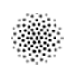
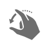

---
layout:
  title:
    visible: true
  description:
    visible: false
  tableOfContents:
    visible: true
  outline:
    visible: true
  pagination:
    visible: true
---

# Retouch and reshape layers

\
The retouching tools are used to make certain edits (like removing objects, brightening, or saturating) to specific parts of an image. Each of these tools is brush-based, meaning you brush or paint over the areas you’d like to retouch. For example, you can easily remove unwanted objects, seamlessly clone parts of your photos, lighten or darken, saturate, desaturate, sharpen, soften, and smudge certain areas — all by simply painting over them. The reshaping tools are also brush-based and they are used to manipulate the shape of areas in an image by warping, bumping, pinching, and twirling.

## Retouching Tools

| Tool                                                                                                                             | Description                                                  |
| -------------------------------------------------------------------------------------------------------------------------------- | ------------------------------------------------------------ |
|  [Repair](remove-an-object-from-an-image.md)                    | Remove small imperfections or entire objects from images.    |
|  [Clone](copy-part-of-an-image-from-one-area-to-another.md)      | Copy parts of an image from one area to another.             |
|  [Lighten](lighten-a-specific-area-of-an-image.md)             | Brighten a specific area of an image.                        |
|  [Darken](darken-a-specific-area-of-an-image.md)                | Darken a specific area of an image.                          |
|  [Saturate](make-a-specific-area-of-an-image-more-vibrant.md) | Make the colors in a specific area of an image more vibrant. |
|  [Desaturate](desaturate-a-specific-area-of-an-image.md)    | Make the colors in a specific area of an image less vibrant. |
|  [Sharpen](sharpen-a-specific-area-of-an-image.md)             | Make a specific area of an image sharper.                    |
|  [Soften](soften-a-specific-area-of-an-image.md)                | Make a specific area of an image softer.                     |
|  [Smudge](smudge-a-specific-area-of-an-image.md)                | Naturally smudge a specific area of an image.                |

## Reshaping Tools

| Tool                                                                                                           | Description                                                 |
| -------------------------------------------------------------------------------------------------------------- | ----------------------------------------------------------- |
|  [Warp](warp-a-specific-area-of-an-image.md)    | Push and pull a specific area of an image in any direction. |
|  [Bump](bump-a-specific-area-of-an-image.md)    | Bump a specific area of an image.                           |
|  [Pinch](pinch-a-specific-area-of-an-image.md) | Pinch a specific area of an image                           |
|  [Twirl](twirl-a-specific-area-of-an-image.md) | Twirl a specific area of an image.                          |
