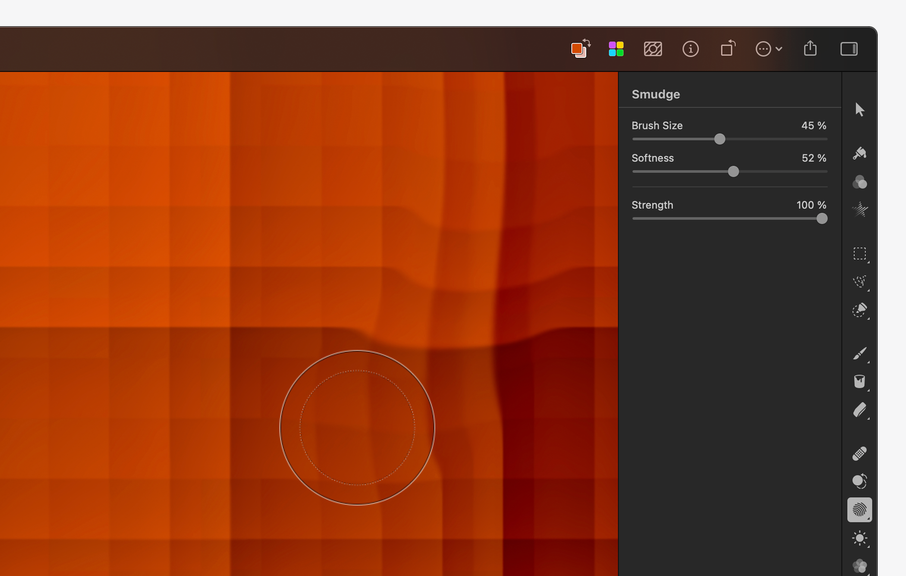

---
layout:
  title:
    visible: true
  description:
    visible: false
  tableOfContents:
    visible: true
  outline:
    visible: true
  pagination:
    visible: true
---

# Smudge a specific area of an image

The Smudge tool is used to smudge a specific area of an image. The effect created is similar to smudging wet paint.

1. Do one of the following:
   * In the Tools sidebar, click Smudge  or choose if from the grouped tools.
   * Choose **Tools > Retouch > Smudge** from the Tools menu at the top of your screen.
2. In the Tool Options pane, customize the Smudge tool:
   1.  _Brush Size:_ Drag the Brush Size slider to adjust the size of the Smudge tool brush. Press and hold the `Option ⌥` key to extend the range of the Brush Size slider beyond 100%. You can also manually enter a value from 0% to 200%.


       :bulb: **Tip:** You can use the `[` and `]` keys on your keyboard to change the size of the Smudge tool brush.
   2. _Softness_: Drag the Softness slider to adjust the softness of the edges of the Smudge tool brush. With softer edges, the smudged areas will usually blend in better with the rest of the image.
   3. _Strength_: Drag the Strength slider to adjust the intensity of the smudging effect.

3. Brush over an area in your image to smudge it.

<figure><figcaption></figcaption></figure>

## Show before and after or reset effects

_Show Original:_ Click the Show Original button to see what the image looked like before.

_Show Split Comparison:_ `Option ⌥` – click the Show Original button or press `Control ⌃` + `C` on your keyboard.

Click Reset to discard all the current changes.
